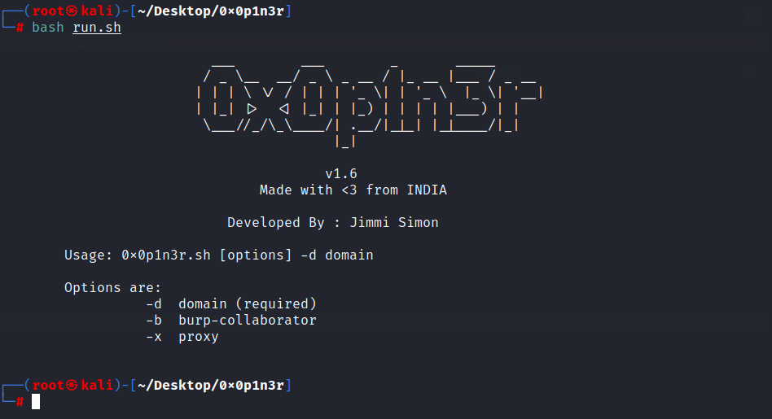

<meta name="description" property="og:description" content="0x0p1n3r - All in one Subdomain Enumeration Tool">
<meta name="author" content="jimmisimon">
<!-- Mobile Specific Meta -->
<meta name="viewport" content="width=device-width, initial-scale=1, shrink-to-fit=no">
<!-- Author Meta -->
<meta name="author" content="colorlib">
<!-- Meta Description -->
<meta name="description" content="0x0p1n3r - All in one Subdomain Enumeration Tool">
<!-- Meta Keyword -->
<meta name="keywords" content="0x0p1n3r - All in one Subdomain Enumeration Tool">
<!-- meta character set -->
<meta charset="UTF-8">
<!-- Site Title -->
		
<h1 align="center"> 0x0p1n3r</h1>
<h3 align="center">All in one sub-domain Enumeration Tool</h3>

<p align="center">
    <br><br>
  
  </p>
  
<br>
<h4>0x0p1n3r is a set of combination of other tools and one line scripts to find sub-domains and check common vulnerabilities </h4>

# Note :
   Read README.md before Installation 
   
# Features

    Find subdomain
	    scripts:
		assetfinder
		gau
		knockpy
		sublist3r
	    domains:
		api.hackertarget.com
		crt.sh
		dns.bufferover.run
		riddler.io
		securitytrails.com
		sonar.omnisint.io
		threatcrowd.org
		web.archive.org
		
	collect IP Address
	Subdomain Takeover 
	Broken Link 
	SSRF
	SSTI
	SQL
	nuclei
	dalfox

# Installation 

```
> git clone https://github.com/z3dc0ps/0x0p1n3r 
```
```
> cd 0x0p1n3r
```
```
> sudo bash setup.sh
```
# Usage
```
> sudo bash run.sh
```

# Demo 




# Special Thanks


 [@Tom Hudson](https://github.com/tomnomnom) <br>
 [@Corben Leo](https://github.com/lc)<br>
 [@Ahmed Aboul-Ela](https://github.com/aboul3la)<br>
 [@Nacho Brihuega](https://github.com/n4xh4ck5)<br>
 [@KingOfBugbounty](https://github.com/KingOfBugbounty)<br>
 [@mallok](https://github.com/m4ll0k)<br>
 
 <br><br>
 
  


<a href="https://www.buymeacoffee.com/jimmisimon" target="_blank"></a>
